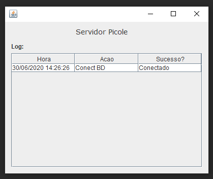
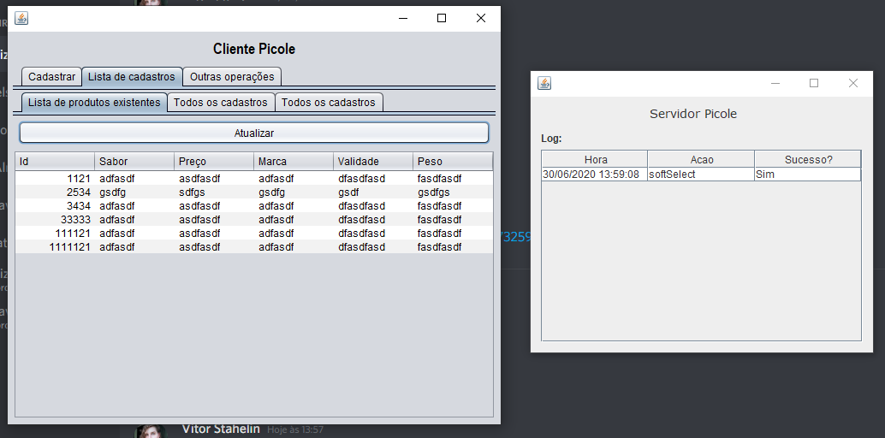

# Configurar banco de dados

O arquivo de configurações do baco de dados esta em "/dbConfigs.txt"  
Para que o banco de dados funcione, deve ser configurado de acordo com o seu banco de dados.

#### Utilizado Java 14

Certifique-se que a Class Path do JAVA esta configurada, caso nao esteja utilize:  
Para rodar o Cliente: $ "C:\Program Files\Java\jdk-14\bin\java.exe" -jar Client.jar  
Para rodar o Servidor: "C:\Program Files\Java\jdk-14\bin\java.exe" -jar Server.jar  

### Hierarquia de pastas do Server:  
- Pasta raiz  
ㅤ|-- Server.jar  
ㅤ'-- dbConfig.txt  

#### v1.0  
- Ainda funcionando em localhost apenas  

### Capturas de tela  
Tela de cadastro e atualizacao  
  

Tela de lista registros ativos  
  

Tela de registros totais  
  

Tela de busca de registro por id  
  

Demais operacoes  

Log do Servidor  
  
