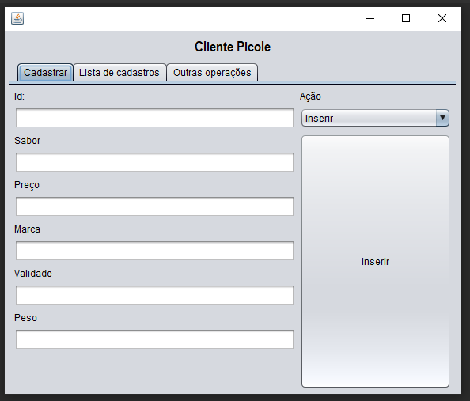
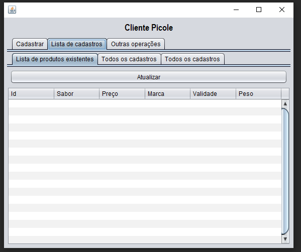
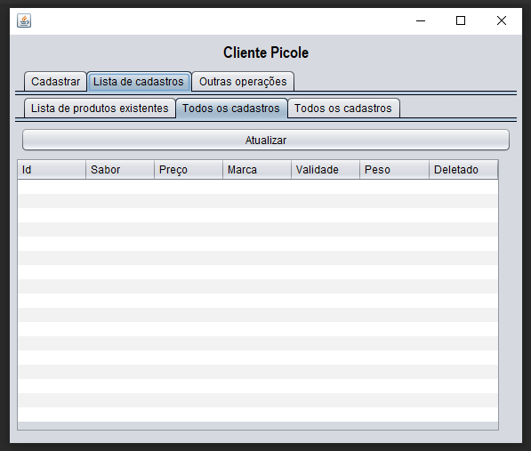
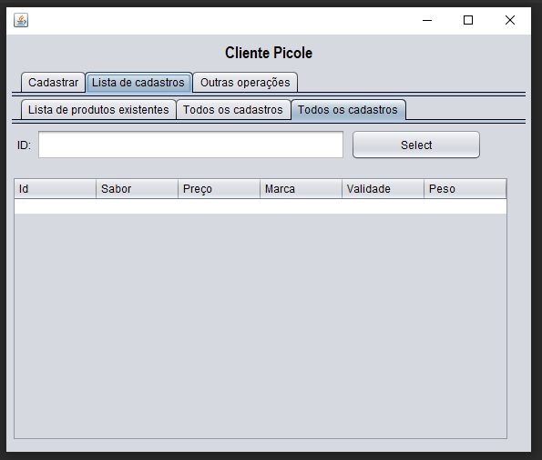
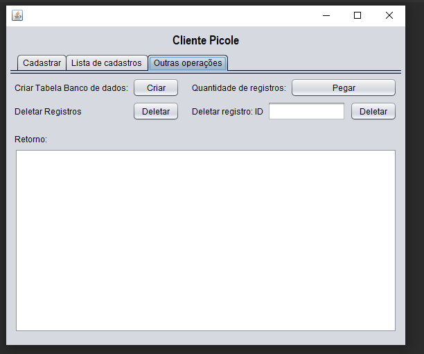

# Configurar banco de dados

O arquivo de configurações do baco de dados esta em "/dbConfigs.txt"  
Para que o banco de dados funcione, deve ser configurado de acordo com o seu banco de dados.

Tela de cadastro e atualizacao  
  

Tela de lista registros ativos  
  

Tela de registros totais  
  

Tela de busca de registro por id  
  

Demais operacoes  
